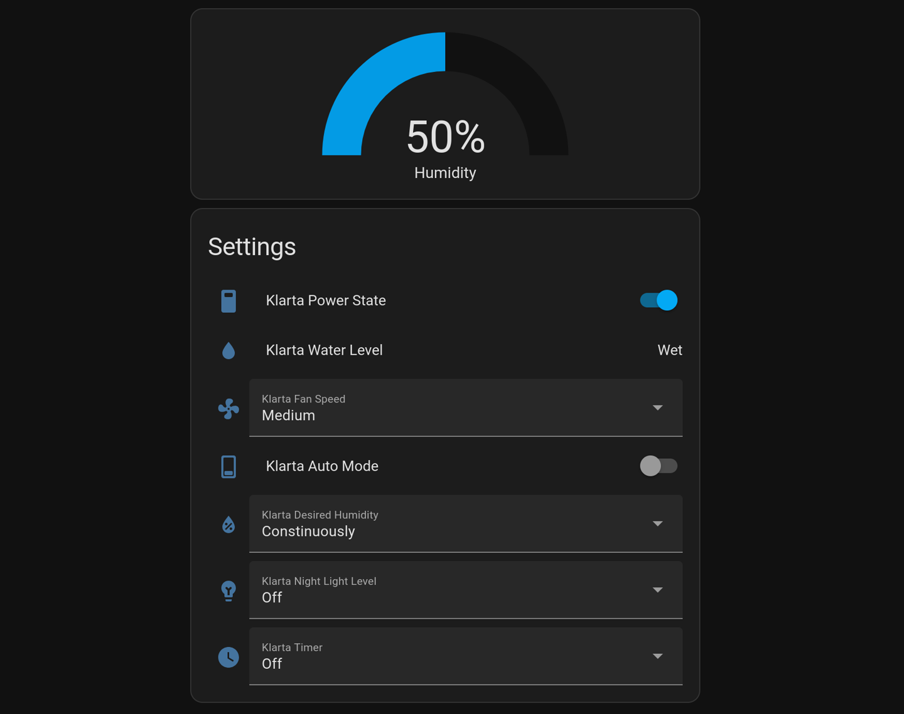

# Klarta Humea Integration with Home Assistant via ESP32 and MQTT
This project enables integration of the Klarta Humea humidifier with Home Assistant using an ESP32 microcontroller. The ESP32 communicates with the humidifier via UART and interfaces with Home Assistant through MQTT. This allows you to control and monitor your Klarta Humea humidifier directly from Home Assistant, bypassing the faulty Local Tuya integration.



# Tested platforms
- ESP32-DevKitC
- Arduino Nano ESP32

# Requirements
- Home Assistant with [the MQTT integration](https://www.home-assistant.io/integrations/mqtt/) or just an MQTT server
- Some ESP32 board
- if the board you have doesn't support a 12V input voltage (the Arduino Nano ESP32 does), then you will need a 12V to 'whatever your board accepts over the Vin pin' regulator
- [PlatformIO CLI](https://docs.platformio.org/en/latest/core/index.html) or [PlatformIO VSCode plugin](https://platformio.org/install/ide?install=vscode)

# Installation
## Home Assistant
- Using file editor, copy the configuration, automations, and packages to your home assistant from the `homeassistant/` directory.
- Create a view using imported entities or just copy the code from `homeassistant/view.yaml`

## Connecting the board
- Remove the Tuya board and connect UART pins to the RX (D12) and TX (D13) pins.
- Connect the power cables to the board's Vin and GND pins directly or through a step-down converter.

## Compilation and upload
- in the src/ directory, create a file named `secrets.h` with following definitions
```C
// Wi-Fi Configuration
#define WIFI_SSID "your_wifi_ssid"
#define WIFI_PASSWORD "your_wifi_password"
#define WIFI_HOSTNAME "klarta"

// MQTT Configuration
#define MQTT_CLIENT_ID "mqtt_client_id" // put whatever here
#define MQTT_USER "mqtt_username"
#define MQTT_PASSWORD "mqtt_password"

// Home Assistant Server Address
#define HA_SERVER_ADDR your_home_assistant_ip_address  // e.g., 192,168,1,21
```
- compile and upload to the board
```bash
pio run -t upload -e esp32dev
```
Replace esp32dev with whatever board you are using. Remember to add the corresponding environment to the `platformio.ini` file.
- If you wish to run in debug mode
```bash
pio run -t upload -e esp32dev-debug && pio device monitor -b 115200 --filter time
```
if you are using different board then remember to add the `-DDEBUG` flag to the `build_flags` option in your `platformio.ini` file

